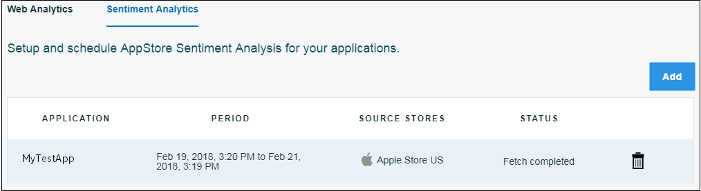

---

copyright:
  years: 2015, 2017
lastupdated: "2017-08-06"

---
{:new_window: target="_blank"}
{:shortdesc: .shortdesc}
{:screen:.screen}
{:codeblock:.codeblock}

# Sentiment Analysis
{: #sentimentanalysis}

## Sentiment Analysis with {{site.data.keyword.mobileanalytics_full}}

Through {{site.data.keyword.mobileanalytics_short}} you can gather and analyze the ratings that the users give to your app.

The Sentiment Analysis capability -

 - Brings together all the review data by extracting them from the public review feeds
 - Consolidates the App store ratings and after further analysis, gives a sentiment score to your app
 - Sentiment score patterns/variations can be visualized using charts
 - Picks keywords from the user feedbacks, keywords give a hint on what the ratings are inclined towards
 
##Configuring Sentiment Analysis

To enable sentiment analysis on your application, complete the below steps:

1. On the {{site.data.keyword.mobileanalytics_short}} console, select the **Configure** tab.

2. Select the **Sentiment Analysis** tab.

3. Click on the **Add** button.  Select the **Appliaction Name** from the drop down menu.

4. Select the **Analysis Period**. 

5. Click on the **Source** and move it to **Selected**.

6. Click **Save**.

You have now configured you application for Sentiment Analysis.

##Analyzing the App Data

The amount of available data you can view depends on the user feedbacks given to your app. Statistical data can be viewed only when the users have given a feedback with comments.

 - On the {{site.data.keyword.mobileanalytics_short}} console, select the **Sentiment Analysis** tab under **APP DATA**.

 - Select the date range, the application and the platform. Below are the charts you will find for your app -

**Sentiment score** for your app based on the review comments provided by the users 

**Classification** of the review comment based on sentiment

The **keywords** that appear most in the review comments of your app

It would take a minimum of 6 hours for the feedback data to reflect in the {{site.data.keyword.mobileanalytics_short}} console after it has been submitted by the user.

Currently, the sentiment analysis feature is available on `IBM Cloud - US South Region` and is applicable on `iOS platform`.

**Note**: The feature is enabled only for users who have opted the `Advanced Pricing Plan`. Select **Plan** in the {{site.data.keyword.mobileanalytics_short}} service console to [upgrade](https://console-tok02-red.cdn.s-bluemix.net/docs/account/change-plan.html#changing)

