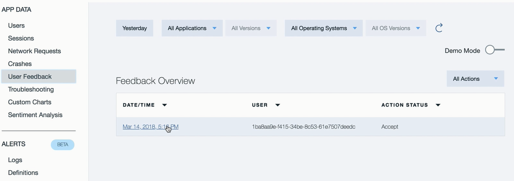

---

copyright:
  years: 2015, 2017
lastupdated: "2017-08-06"

---
{:new_window: target="_blank"}
{:shortdesc: .shortdesc}
{:screen:.screen}
{:codeblock:.codeblock}

# App-interne Feedbackanalyse
{: #In-App}

## App-interne Feedbackanalyse mit Mobile Analytics

Mit dieser Funktion von {{site.data.keyword.mobileanalytics_short}} haben Sie folgende Möglichkeiten: 

- **Benutzer und Tester** können Feedback und Programmfehlerberichte "App-intern" aufzeichnen und senden, während sie ausgeführt werden und die Anwendung verwenden.
- **App-Eigner** erhalten mehr Einblick in die Erfahrungen des Anwendungsbenutzers mit diesem kontextreichen Benutzerfeedback.
- **Entwickler** ihrerseits erhalten genaue Anwendungskontexte, um Fehler oder Funktionsmängel zu diagnostizieren und zu beheben.

## App-internes Feedback aktivieren

Führen Sie die folgenden Schritte aus, um Ihre mobile Anwendung für die Erfassung von App-internem Benutzerfeedback zu aktivieren:

**Instrumentieren Sie Ihre App:**

 - Instrumentieren Sie Ihre mobile App für den Feedbackmodus. Rufen Sie die API `Analytics.triggerFeedbackMode();` auf, um den Feedbackmodus aufzurufen. Weitere Informationen finden Sie in der [Dokumentation](/docs/services/mobileanalytics/sdk.html).
 - Die API kann für jedes Anwendungsereignis aufgerufen werden, z. B. für Schaltflächen, Menüaktionen oder Gesten. 
 
**App-internes Feedback empfangen**

 - Endbenutzer und Tester Ihrer App können in den Feedbackmodus wechseln, indem sie die Anwendungsaktion auslösen, die im vorherigen Schritt hierfür instrumentiert wurde.
 - Im Feedbackmodus kann kontextreiches Feedback zusammen mit einem Screenshot gesammelt und an den {{site.data.keyword.mobileanalytics_short}}-Service gesendet werden.

**App-internes Feedback analysieren und daraufhin handeln**

 - Der {{site.data.keyword.mobileanalytics_short}}-Service empfängt und konsolidiert das kontextreiche Feedback, das von mobilen Anwendungen gesendet wird.
 - Melden Sie sich bei der Mobile Analytics-Servicekonsole an und wählen Sie die Option **Benutzerfeedback** im linken Navigationsbereich der {{site.data.keyword.mobileanalytics_short}}-Servicekonsole, um die Feedbacks anzuzeigen.

 
 - Ein App-Eigner kann das Feedback prüfen, Kommentare hinzufügen und das Feedback mit dem Tag **Überprüfungsstatus** versehen. Kommentare können typischerweise geplante Aktionen wie z. B. Links zu Git-Fragen sein, die für die Arbeit an dem Feedback oder den Kommentaren erstellt wurden, oder eine Angabe von Gründen, warum auf dieses Feedback hin keine Aktion erforderlich ist.   
 - Der Überprüfungsstatus kann verwendet werden, um das Feedback effizient zu verwalten, indem es unter einem der unterschiedlichen Status kategorisiert wird.

 

**Hinweis:**

 - Die Funktion wird nur für Benutzer aktiviert, die den `Erweiterten Plan` gewählt haben. Wählen Sie **Plan** in der {{site.data.keyword.mobileanalytics_short}}-Servicekonsole, um ein [Upgrade](https://console-tok02-red.cdn.s-bluemix.net/docs/account/change-plan.html#changing) durchzuführen.

 - Derzeit wird diese Funktion nur für Android unterstützt.

