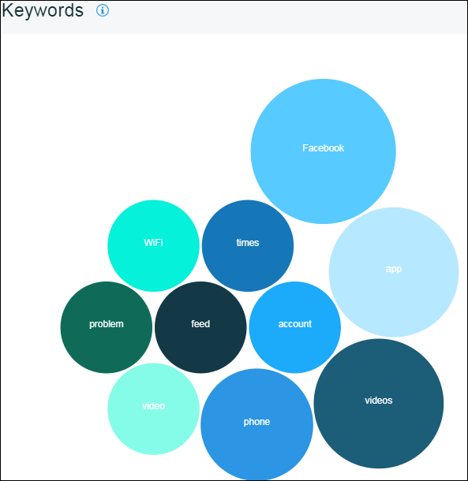

---

copyright:
  years: 2015, 2017
lastupdated: "2017-08-06"

---
{:new_window: target="_blank"}
{:shortdesc: .shortdesc}
{:screen:.screen}
{:codeblock:.codeblock}

# Stimmungsanalyse
{: #sentimentanalysis}

## Stimmungsanalyse mit Mobile Analytics

Mithilfe von {{site.data.keyword.mobileanalytics_short}} können Sie die Bewertungen, die Ihre Benutzer der App geben, sammeln und analysieren.

Die Funktion der Stimmungsanalyse ermöglicht Folgendes:

 - Vereint alle Überprüfungsdaten, indem sie sie aus den öffentlichen Überprüfungs-Feeds extrahiert
 - Konsolidiert die App-Store-Bewertungen und verleiht Ihrer App nach weiterer Analyse einen Stimmungs-Score
 - Die Muster/Variationen der Stimmungs-Scores können mittels Diagrammen visualisiert werden
 - Entnimmt Schlüsselwörter aus Benutzerfeedbacks. Solche Schlüsselwörter weisen auf eine Tendenz der Bewertungen hin
 
## Stimmungsanalyse konfigurieren

Um die Stimmungsanalyse für Ihre Anwendung zu aktivieren, führen Sie die folgenden Schritte aus:

1. Wählen Sie in der {{site.data.keyword.mobileanalytics_short}}-Konsole die Registerkarte **Konfigurieren** aus.

2. Wählen Sie die Registerkarte **Stimmungsanalyse**.

3. Klicken Sie auf die Schaltfläche **Hinzufügen**.  Wählen Sie eine Option für **Anwendungsname** aus dem Dropdown-Menü aus.

4. Wählen Sie den **Analysezeitraum** aus. 

5. Klicken Sie auf die **Quelle** und verschieben Sie sie nach **Ausgewählt**.

6. Klicken Sie auf **Speichern**.

Sie haben Ihre Anwendung jetzt für die Stimmungsanalyse konfiguriert.

## App-Daten analysieren

Die Menge der verfügbaren Daten, die Sie anzeigen können, ist von den Benutzerfeedbacks abhängig, die Ihrer App gegeben wurden. Statistische Daten können nur dann angezeigt werden, wenn die Benutzer Feedbacks mit Kommentaren gegeben haben.

 - Wählen Sie in der {{site.data.keyword.mobileanalytics_short}}-Konsole die Registerkarte **Stimmungsanalyse** unter **APP-DATEN** aus.

 - Wählen Sie den Datumsbereich, die Anwendung und die Plattform aus. Unten sind die Diagramme aufgeführt, die Sie für Ihre App finden. 

**Stimmungs-Score** für Ihre App auf Grundlage der von den Benutzern angegebenen Überprüfungskommentare 

**Klassifizierung** der Überprüfungskommentare auf Grundlage der Stimmung

Die **Schlüsselwörter**, die in den Überprüfungskommentaren Ihrer Apps am häufigsten vorkommen

Es würde mindestens 6 Stunden dauern, bis die Feedbackdaten in der {{site.data.keyword.mobileanalytics_short}}-Konsole wiedergegeben werden, nachdem sie vom Benutzer eingereicht wurden.

**Hinweis:**
 - Die Funktion wird nur für Benutzer aktiviert, die den `Erweiterten Plan` gewählt haben. Wählen Sie **Plan** in der {{site.data.keyword.mobileanalytics_short}}-Servicekonsole, um ein [Upgrade](https://console-tok02-red.cdn.s-bluemix.net/docs/account/change-plan.html#changing) durchzuführen.
 - Derzeit ist die Stimmungsanalysefunktion in `IBM Cloud - US South Region` verfügbar und kann auf die `iOS-Plattform` angewendet werden.

