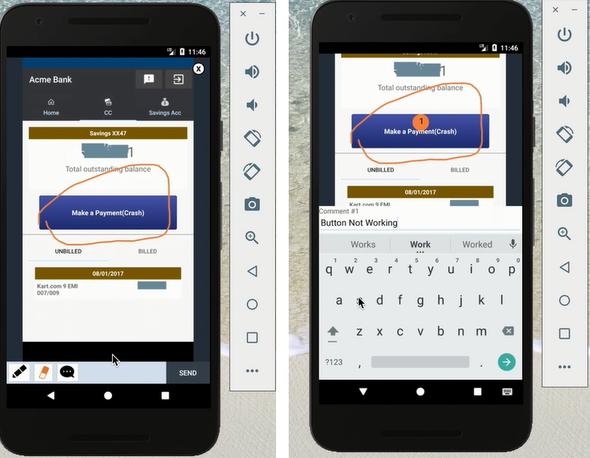

---

copyright:
  years: 2015, 2017
lastupdated: "2017-08-06"

---
{:new_window: target="_blank"}
{:shortdesc: .shortdesc}
{:screen:.screen}
{:codeblock:.codeblock}

# Análisis de comentarios integrados en la app
{: #In-App}

## Análisis de comentarios integrados en la app con Mobile Analytics

Con esta característica de {{site.data.keyword.mobileanalytics_short}}:

- Los **usuarios y responsables de las pruebas** pueden registrar y enviar comentarios e informes de errores 'integrados en la app' a medida que ejecutan y utilizan la aplicación
- Los **propietarios de apps** reciben información detallada sobre la experiencia del usuario con la aplicación con el contexto de los comentarios de los usuarios
- Los **desarrolladores**, por otro lado, obtienen contextos precisos de la aplicación para diagnosticar y solucionar problemas o deficiencias de las características

## Habilitación de comentarios integrados en la app

Siga estos pasos para permitir que la aplicación para móviles capture comentarios de los usuarios integrados en la app.

**Prepare la app: **

 - Prepare la app para móvil para que entre en la modalidad de comentarios. Llame a la API  `Analytics.triggerFeedbackMode();` para invocar la modalidad de comentarios. Para obtener más información, [consulte la documentación](/docs/services/mobileanalytics/sdk.html)
 - Se puede llamar a la API en cualquier suceso de la aplicación como por ejemplo botones o acciones de menú. 
 
**Recibir comentarios integrados en la app**

 - Los usuarios finales y los encargados de las pruebas de su app pueden cambiar a la modalidad de comentarios activando la acción de la aplicación que está preparada para esto en el paso anterior
 - Desde el contexto de la modalidad de comentarios, se pueden obtener comentarios junto con una captura de pantalla, que se pueden enviar al servicio {{site.data.keyword.mobileanalytics_short}}

**Analizar los comentarios integrados en la app y actuar en función del mismo**

 - El servicio {{site.data.keyword.mobileanalytics_short}} recibe y consolida los comentarios enviados desde las aplicaciones para móviles
 - Inicie una sesión en la consola de Mobile Analytics Service y seleccione la opción **Comentarios del usuario** en el panel de navegación izquierdo de la consola del servicio {{site.data.keyword.mobileanalytics_short}} para ver los comentarios

 
 - Un propietario de la app puede revisar los comentarios y comentar y etiquetar los comentarios con un **estado de revisión**.  Los comentarios podrían ser acciones planificadas, como enlaces a temas de Git creados para trabajar con la información o los comentarios podrían constituir la declaración de las razones por las que no es necesaria ninguna acción en la respuesta.   
 - El estado de revisión se puede utilizar para gestionar de forma eficiente los comentarios clasificándolos bajo uno de los diferentes estados

 

**Nota:**

 - La característica solo está habilitada para los usuarios que han optado por el `Plan avanzado`. Seleccione **Plan** en la consola del servicio {{site.data.keyword.mobileanalytics_short}} para [actualizar](https://console-tok02-red.cdn.s-bluemix.net/docs/account/change-plan.html#changing).

 - Actualmente, esta característica sólo se admite en Android.

