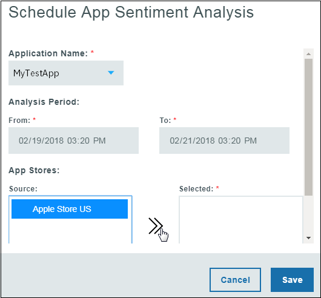
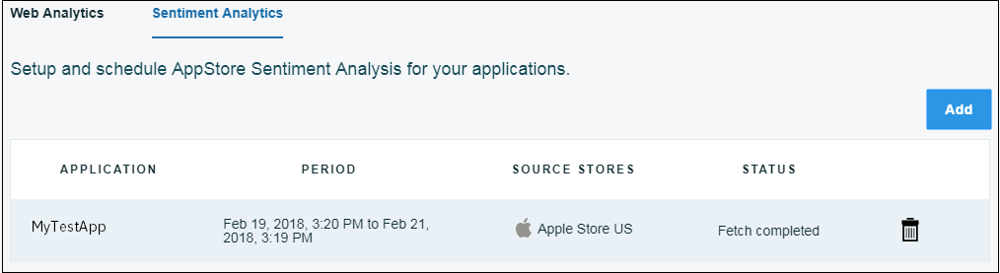

---

copyright:
  years: 2015, 2017
lastupdated: "2017-08-06"

---
{:new_window: target="_blank"}
{:shortdesc: .shortdesc}
{:screen:.screen}
{:codeblock:.codeblock}

# Análisis de sentimiento
{: #sentimentanalysis}

## Análisis de sentimiento con Mobile Analytics

Con {{site.data.keyword.mobileanalytics_short}} puede obtener y analizar las calificaciones que los usuarios dan a su app.

La función Análisis de sentimiento -

 - Aúna todos los datos de evaluación extrayéndolos de los comentarios de evaluación del público
 - Consolida las calificaciones de la tienda de apps después de analizarlas y asigna a la app una calificación de sentimiento
 - Las variaciones y los patrones de las calificaciones de sentimiento se pueden consultar mediante gráficos
 - Se pueden seleccionar palabras clave de los comentarios de los usuarios; las palabras claves ofrecen pistas sobre hacia dónde se inclinan las calificaciones
 
## Configuración del análisis de sentimiento

Para habilitar el análisis de sentimiento en su aplicación, siga los pasos siguientes:

1. En la consola {{site.data.keyword.mobileanalytics_short}}, seleccione el separador **Configurar**.

2. Seleccione el separador **Análisis de sentimiento**.

3. Pulse el botón
**Añadir**.  Seleccione el **Nombre de la aplicación** en el menú desplegable.

4. Seleccione el **Periodo de análisis**. 

5. Pulse en el **Origen** para moverlo a **Seleccionados**.

6. Pulse **Guardar**.

Ahora ha configurado la aplicación para el Análisis de sentimiento.

## Análisis de los datos de la app

La cantidad de datos disponibles que puede ver depende de los comentarios de los usuarios sobre su app. Los datos estadísticos solo se pueden ver cuando los usuarios han dado una respuesta con comentarios.

 - En la consola de {{site.data.keyword.mobileanalytics_short}}, seleccione el separador **Análisis de sentimiento** bajo **DATOS DE LA APP**.

 - Seleccione el rango de fechas, la aplicación y la plataforma. A continuación encontrará los gráficos que podrá ver para su app:

**Puntuación de sentimiento** sobre su app en función de los comentarios de evaluación proporcionados por los usuarios 

**Clasificación** de los comentarios de evaluación basada en las opiniones

Las **palabras clave** que más aparecen en los comentarios de evaluación de su app

Los datos de los comentarios tardarán al menos 6 horas en verse reflejados en la consola de {{site.data.keyword.mobileanalytics_short}} después de que el usuario los envíe.

**Nota:**
 - La característica solo está habilitada para los usuarios que han optado por el `Plan avanzado`. Seleccione **Plan** en la consola del servicio {{site.data.keyword.mobileanalytics_short}} para [actualizar](https://console-tok02-red.cdn.s-bluemix.net/docs/account/change-plan.html#changing).
 - Actualmente, la característica de análisis de sentimiento está disponible en `IBM Cloud - Región EE.UU. Sur` y se aplica a la `plataforma iOS`.

