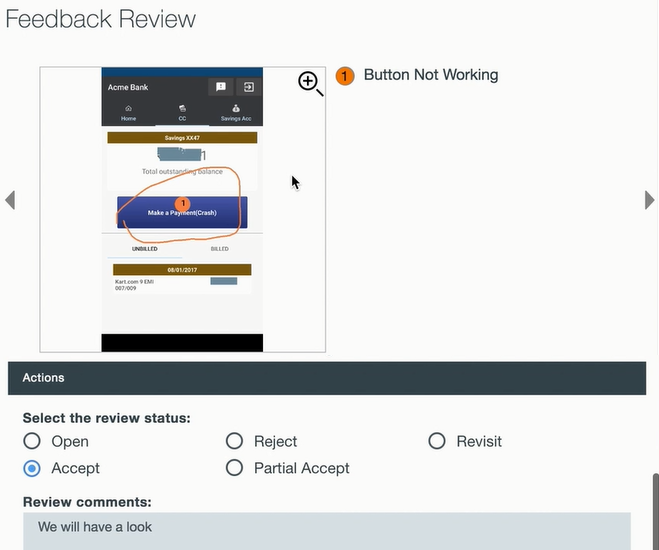

---

copyright:
  years: 2015, 2017
lastupdated: "2017-08-06"

---
{:new_window: target="_blank"}
{:shortdesc: .shortdesc}
{:screen:.screen}
{:codeblock:.codeblock}

# Analyse des commentaires en retour depuis l'application
{: #In-App}

## Analyse des commentaires en retour depuis l'application avec Mobile Analytics

Grâce à cette fonction de {{site.data.keyword.mobileanalytics_short}} -

- Les **utilisateurs et testeurs** peuvent enregistrer et envoyer des commentaires en retour et des rapports de bogue depuis l'application, lorsqu'ils exécutent et utilisent l'application. 
- Les **propriétaires d'application** peuvent mieux appréhender l'expérience utilisateur pour l'application grâce à ces commentaires contextuels enrichis des utilisateurs. 
- D'autre part, les **développeurs** reçoivent des contextes d'application précis pour diagnostiquer et corriger les bogues/déficiences de fonctions.

## Activation des commentaires en retour depuis l'application

Procédez comme suit pour permettre à votre application mobile de capturer les commentaires en retour des utilisateurs de l'application.

**Instrumentez votre application**

 - Instrumentez votre application mobile pour passer en mode commentaire. Appelez l'API `Analytics.triggerFeedbackMode();` pour passer en mode commentaire. Pour plus d'informations, [consultez la documentation](/docs/services/mobileanalytics/sdk.html).
 - L'API peut être appelée sur n'importe quel événement d'application tel que des boutons, des actions de menu ou des gestes.  
 
**Recevez des commentaires en retour depuis l'application**

 - Les utilisateurs finaux et les testeurs de votre application peuvent passer en mode commentaire en déclenchant l'action de l'application à l'origine de l'instrumentation au cours de l'étape précédente.
 - Le mode commentaire permet de collecter et d'envoyer au service {{site.data.keyword.mobileanalytics_short}} des commentaires contextuels enrichis, accompagnés d'une capture d'écran.

**Analysez les commentaires en retour depuis l'application et agissez dessus**

 - Le service {{site.data.keyword.mobileanalytics_short}} reçoit et consolide les commentaires contextuels enrichis envoyés depuis des applications mobiles.
 - Connectez-vous à la console de maintenance Mobile Analytics et sélectionnez l'option **Commentaires en retour des utilisateurs** dans le panneau de navigation de gauche de la console de maintenance {{site.data.keyword.mobileanalytics_short}} pour afficher les commentaires. 

 
 - Un propriétaire d'application peut passer en revue les commentaires, en ajouter et les baliser à l'aide du **statut de vérification**.  Les commentaires sont généralement des actions planifiées telles que des liens vers des problèmes Git créés pour travailler sur le commentaire, ou peuvent être l'expression des raisons pour lesquelles aucune action n'est requise sur le commentaire en retour.    
 - Le statut de vérification peut être utilisé pour gérer efficacement les commentaires en retour en les classant sous l'un des différents statuts.

 

**Remarque :**

 - La fonction est activée uniquement pour les utilisateurs qui ont opté pour le `plan Avancé`. Sélectionnez **Plan** dans la console de maintenance {{site.data.keyword.mobileanalytics_short}} pour effectuer une [mise à niveau](https://console-tok02-red.cdn.s-bluemix.net/docs/account/change-plan.html#changing). 

 - Actuellement, cette fonction est uniquement prise en charge sous Android.

