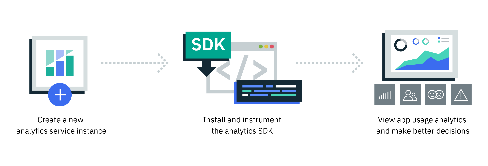

---

copyright:
  years: 2016, 2017
lastupdated: "2017-07-14"

---
{:new_window: target="_blank"}
{:shortdesc: .shortdesc}
{:screen:.screen}
{:codeblock:.codeblock}

# Tutoriel de mise en route

{: #gettingstartedtemplate}

{{site.data.keyword.mobileanalytics_full}} aide les développeurs, les administrateurs informatiques et les parties prenantes à obtenir des informations détaillées sur les performances et l'utilisation de leurs applications mobiles.  

{{site.data.keyword.mobileanalytics_short}} vous permet -

* De surveiller les performances et l'utilisation de toutes vos applications depuis votre bureau ou votre tablette. 
* D'identifier rapidement les tendances et les anomalies, d'accéder aux détails pour résoudre les problèmes et de déclencher des alertes lorsque des mesures clés dépassent des seuils critiques. 
{: shortdesc}

Procédures de base qui vous permettront de démarrer :

1. [Exécution des prérequis](/docs/services/mobileanalytics/app-prerequisites.html)
2. [Instrumentation de votre application](/docs/services/mobileanalytics/app-instrument.html)
3. Compilation et exécution de l'application sur votre émulateur ou périphérique
4. [Obtention des données de l'application](/docs/services/mobileanalytics/app-monitoring-metrics.html)

L'image suivante présente le cycle de vie du service {{site.data.keyword.mobileanalytics_short}}.

##Mode démonstration

L'option **Mode démonstration** est disponible dans la console {{site.data.keyword.mobileanalytics_short}}, qui permet d'afficher les vues et les graphiques avec des **données de démonstration**. Le mode démonstration est le mode par défaut de la console lorsqu'elle est lancée pour la première fois après l'instanciation du service. Lorsque vous disposez de vos propres applications et données d'analyse alimentées dans le service, vous pouvez *désactiver* le mode démonstration pour afficher les données de votre application dans les différents graphiques. La console {{site.data.keyword.mobileanalytics_short}} est accessible en lecture seule lorsque le mode démonstration est activé et vous ne pouvez donc pas créer de nouvelles définitions d'alerte.

