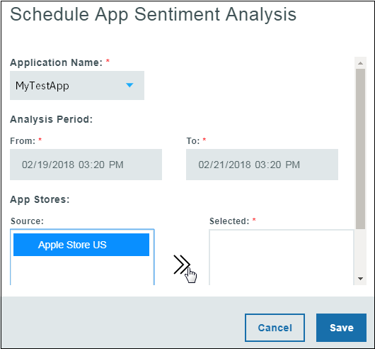

---

copyright:
  years: 2015, 2017
lastupdated: "2017-08-06"

---
{:new_window: target="_blank"}
{:shortdesc: .shortdesc}
{:screen:.screen}
{:codeblock:.codeblock}

# Analisi delle valutazioni 
{: #sentimentanalysis}

## Analisi delle valutazioni con Mobile Analytics

Tramite {{site.data.keyword.mobileanalytics_short}} puoi raccogliere e analizzare le valutazioni fatte degli utenti sulla tua applicazione.

La funzionalità di analisi delle valutazioni -

 - Riunisce tutti i dati di revisione estraendoli dai feed di revisione pubblici
 - Consolida le valutazioni dell'App store e dopo ulteriori analisi, fornisce un punteggio di valutazione alla tua applicazione
 - Le variazioni e i modelli del punteggio di valutazione possono essere visualizzati utilizzando i grafici
 - Prende le parole chiave dai feedback utente, le parole chiave danno un indizio su quale valutazione viene data
 
## Configurazione dell'analisi delle valutazioni

Per abilitare l'analisi delle valutazioni per la tua applicazione, completa la seguente procedura:

1. Nella console {{site.data.keyword.mobileanalytics_short}}, seleziona la scheda **Configura**.

2. Seleziona la scheda **Analisi delle valutazioni**.

3. Fai clic sul pulsante **Aggiungi**. Seleziona il **Nome applicazione** dal menu a discesa.

4. Seleziona il **Periodo di analisi**. 

5. Fai clic su **Origine** e spostala a **Selezionata**.

6. Fai clic su **Salva**.

Hai ora configurato la tua applicazione per l'analisi delle valutazioni.

## Analisi dei dati dell'applicazione 

La quantità di dati disponibili che puoi visualizzare dipende dai feedback utente forniti alla tua applicazione. I dati statistici possono essere visualizzati solo quando gli utenti hanno fornito un feedback con commenti.

 - Nella console {{site.data.keyword.mobileanalytics_short}}, seleziona la scheda **Analisi delle valutazioni** in **DATI APPLICAZIONE**.

 - Seleziona l'intervallo di date, l'applicazione e la piattaforma. I seguenti sono i grafici che troverai per la tua applicazione -

**Punteggio valutazione** della tua applicazione in base ai commenti di revisione forniti dagli utenti 

**Classificazione** del commento di revisione in base alla valutazione

Le **parole chiave** visualizzate maggiormente dei commenti di revisione della tua applicazione

Serve un minimo di 6 ore perché i dati del feedback vengano mostrati nella console {{site.data.keyword.mobileanalytics_short}} dopo che sono stati inviati dall'utente.

**Nota:**
 - La funzione è abilitata solo per gli utenti che hanno scelto il `Piano avanzato`. Seleziona **Piano** nella console del servizio {{site.data.keyword.mobileanalytics_short}} per l'[upgrade](https://console-tok02-red.cdn.s-bluemix.net/docs/account/change-plan.html#changing) .
 - Al momento, la funzione di analisi delle valutazioni è disponibile solo in `IBM Cloud - Regione Stati Uniti Sud` ed è applicabile sulla `piattaforma iOS`.

