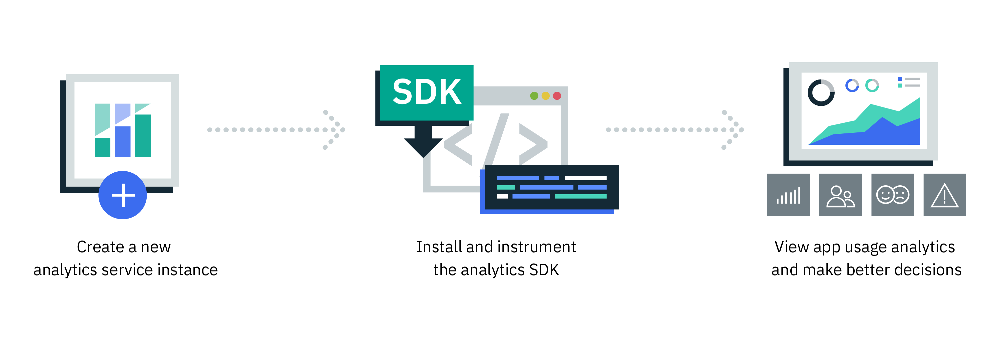

---

copyright:
  years: 2016, 2017
lastupdated: "2017-07-14"

---
{:new_window: target="_blank"}
{:shortdesc: .shortdesc}
{:screen:.screen}
{:codeblock:.codeblock}

# Esercitazione introduttiva

{: #gettingstartedtemplate}

{{site.data.keyword.mobileanalytics_full}} fornisce aiuto agli sviluppatori, agli amministratori IT e alle parti interessate di business per approfondire come vengono eseguite le applicazioni e come stanno venendo utilizzate. 

{{site.data.keyword.mobileanalytics_short}} ti consente di -

* Monitora le prestazioni e l'utilizzo di tutte le tue applicazioni dal tuo desktop o tablet. 
* Identifica velocemente gli andamenti e le anomalie, esegue il drilldown per risolvere i problemi e attiva gli avvisi quando le metriche chiave superano le soglie critiche. 
{: shortdesc}

Passi di base introduttivi: 

1. [Completa i prerequisiti](/docs/services/mobileanalytics/app-prerequisites.html)
2. [Instrumenta la tua applicazione ](/docs/services/mobileanalytics/app-instrument.html)
3. Compila ed esegui l'applicazione sul tuo emulatore o sul tuo dispositivo.
4. [Ottieni i dati dell'applicazione](/docs/services/mobileanalytics/app-monitoring-metrics.html)

La seguente immagine ti fornisce una panoramica del ciclo di vita del servizio {{site.data.keyword.mobileanalytics_short}}.

##Modalità demo

L'opzione **Modalità demo** è disponibile nella console {{site.data.keyword.mobileanalytics_short}}, in cui le viste e i grafici visualizzano i **dati demo**.
La modalità demo è la modalità predefinita della console all'avvio iniziale dopo aver istanziato il servizio. Quando disponi delle tue proprie applicazioni e i
dati di analisi hanno popolato il servizio, puoi *disattivare* la modalità demo per visualizzare i dati della tua applicazione
in grafici diversi. La console {{site.data.keyword.mobileanalytics_short}} è in sola lettura nella modalità demo, quindi non sarai in grado di creare nuove definizioni dell'avviso.

