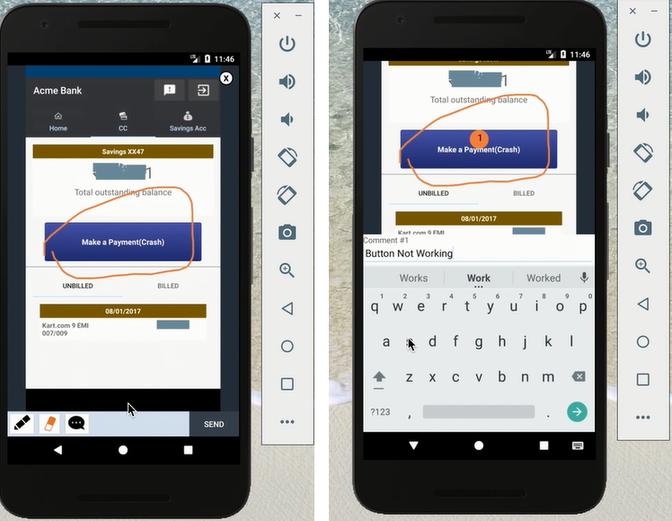

---

copyright:
  years: 2015, 2017
lastupdated: "2017-08-06"

---
{:new_window: target="_blank"}
{:shortdesc: .shortdesc}
{:screen:.screen}
{:codeblock:.codeblock}

# アプリ内フィードバック分析
{: #In-App}

## Mobile Analytics によるアプリ内フィードバック分析

{{site.data.keyword.mobileanalytics_short}} のこの機能を使用して、以下を行なうことができます。

- **ユーザーおよびテスター**は、アプリケーションを実行して使用するときに、フィードバックおよびバグ・レポートをアプリ内で記録して送信できます。
- **アプリ所有者**は、このコンテキストの豊富なユーザー・フィードバックにより、アプリケーションのユーザー・エクスペリエンスをより深く理解できます。
- 一方、**開発者**は、バグ/機能不足を診断して修正するための正確なアプリケーション・コンテキストを受け取ります。

## アプリ内フィードバックの有効化

以下のステップを実行して、モバイル・アプリケーションがアプリ内ユーザー・フィードバックを収集できるようにします。

**アプリの装備**

 - フィードバック・モードを開始するようにご使用のモバイル・アプリを設定します。API `Analytics.triggerFeedbackMode();` を呼び出して、フィードバック・モードを起動します。詳しくは、[資料を参照してください](/docs/services/mobileanalytics/sdk.html)。
 - この API は、ボタン、メニュー・アクション、ジェスチャーなどのアプリケーション・イベントで呼び出すことができます。 
 
**アプリ内フィードバックの受信**

 - アプリのエンド・ユーザーおよびテスターは、前のステップでこの操作を行うために装備されたアプリケーション・アクションを起動することによって、フィードバック・モードに切り替えることができます。
 - フィードバック・モード内から、スクリーン・ショットとともにリッチ・コンテキスト・フィードバックを収集し、{{site.data.keyword.mobileanalytics_short}} サービスに送信できます。

**アプリ内フィードバックの分析および実行**

 - {{site.data.keyword.mobileanalytics_short}} サービスは、モバイル・アプリケーションから送信されるリッチ・コンテキスト・フィードバックを受信して統合します。
 - Mobile Analytics サービス・コンソールにログオンし、{{site.data.keyword.mobileanalytics_short}} サービス・コンソールの左側のナビゲーション・ペインで「**ユーザー・フィードバック (User Feedback)**」オプションを選択して、フィードバックを表示します。

 
 - アプリ所有者は、フィードバックを確認し、コメントを追加したり、フィードバックに **レビュー状況**のタグを付けたりすることができます。コメントは通常、フィードバックに対する処理として作成された Git issue へのリンクなど、計画されたアクションになります。または、コメントはフィードバックに対するアクションが必要でない理由に関する記述にすることもできます。   
 - レビュー状況を使用すると、さまざまな状況のいずれかでフィードバックをカテゴリー化することにより、フィードバックを効率的に管理できます。

 

**注:**

 - この機能は、`「拡張プラン」`を選択したユーザーに対してのみ有効になります。{{site.data.keyword.mobileanalytics_short}} サービス・コンソールで**「プラン」**を選択して、[アップグレード](https://console-tok02-red.cdn.s-bluemix.net/docs/account/change-plan.html#changing)を実行します。

 - 現在、この機能は Android でのみサポートされています。

