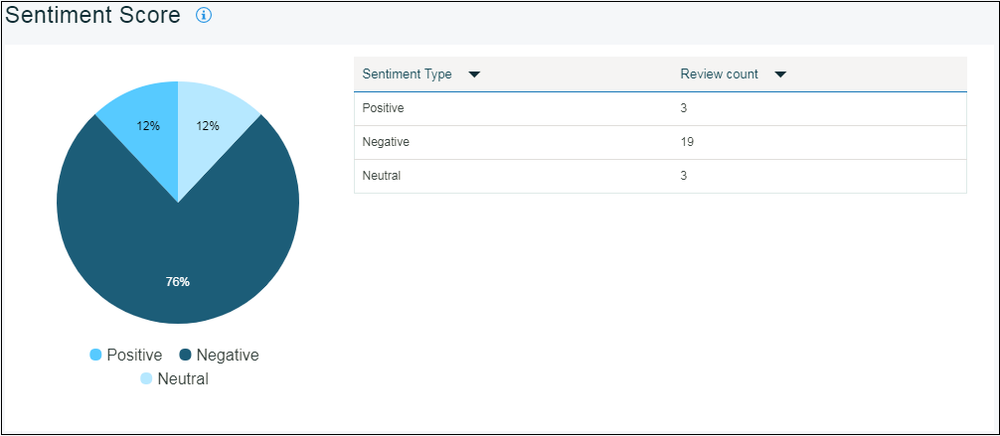

---

copyright:
  years: 2015, 2017
lastupdated: "2017-08-06"

---
{:new_window: target="_blank"}
{:shortdesc: .shortdesc}
{:screen:.screen}
{:codeblock:.codeblock}

# 評判分析
{: #sentimentanalysis}

## Mobile Analytics による評判分析

{{site.data.keyword.mobileanalytics_short}} を使用して、ユーザーがアプリに提供するレーティングを収集して分析することができます。

評判分析機能 -

 - すべてのレビュー・データを公開レビュー・フィードから抽出してまとめます
 - App Store レーティングを統合し、さらに分析した後、アプリに評判スコアを提供します
 - 評判スコアのパターン/バリエーションは、グラフを使用して視覚化できます
 - ユーザー・フィードバックからキーワードを選出します。キーワードは、評価の傾向に関するヒントを提供します
 
## 評判分析の構成

アプリケーションで評判分析を有効にするには、以下の手順を実行します。

1. {{site.data.keyword.mobileanalytics_short}} コンソールで、**「構成」**タブを選択します。

2. **「評判分析」**タブを選択します。

3. **「追加」**ボタンをクリックします。ドロップダウン・メニューから**「アプリケーション名 (Appliaction Name)」**を選択します。

4. **「分析期間 (Analysis Period)」**を選択します。 

5. **「ソース」**をクリックし、それを**「選択済み (Selected)」**に移動します。

6. **「保存」**をクリックします。

これで、評判分析用のアプリケーションが構成されました。

## アプリ・データの分析

表示できる使用可能なデータの量は、アプリに提供されたユーザー・フィードバックによって異なります。統計データは、ユーザーがコメント付きのフィードバックを提供した場合にのみ表示できます。

 - {{site.data.keyword.mobileanalytics_short}} コンソールで、**「アプリ・データ (APP DATA)」**の下の**「評判分析 (Sentiment Analysis)」**タブを選択します。

 - 日付範囲、アプリケーション、およびプラットフォームを選択します。アプリに表示されるグラフを以下に示します。

ユーザーが提供するレビュー・コメントに基づくアプリの**評判スコア** 

評判に基づくレビュー・コメントの**種別**

アプリのほとんどのレビュー・コメント内に現れる**キーワード**

フィードバック・データがユーザーによって送信された後 {{site.data.keyword.mobileanalytics_short}} コンソールに反映されるまでには、少なくとも 6 時間かかります。

**注:**
 - この機能は、`「拡張プラン」`を選択したユーザーに対してのみ有効になります。{{site.data.keyword.mobileanalytics_short}} サービス・コンソールで**「プラン」**を選択して、[アップグレード](https://console-tok02-red.cdn.s-bluemix.net/docs/account/change-plan.html#changing)を実行します。
 - 現在、評判分析機能は `IBM Cloud - 米国南部地域`で使用でき、`iOS プラットフォーム`で利用可能です。

