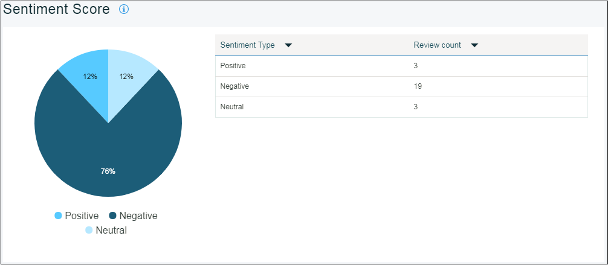

---

copyright:
  years: 2015, 2017
lastupdated: "2017-08-06"

---
{:new_window: target="_blank"}
{:shortdesc: .shortdesc}
{:screen:.screen}
{:codeblock:.codeblock}

# 감성 분석
{: #sentimentanalysis}

## Mobile Analytics를 사용하여 감성 분석

{{site.data.keyword.mobileanalytics_short}}를 통해 사용자가 앱에 부여하는 등급을 수집하고 분석할 수 있습니다.

감성 분석 기능 -

 - 공용 검토 피드에서 데이터를 추출하여 모든 검토 데이터를 수집합니다.
 - 앱 저장소 등급을 통합하고 추가 분석 이후에 앱에 감성 점수를 부여합니다.
 - 차트를 사용하여 감성 점수 패터/변형을 시각화할 수 있습니다.
 - 사용자 피드백에서 키워드를 선택하고 키워드는 지정되는 등급이 무엇인지에 대한 힌트를 제공합니다.
 
## 감성 분석 구성

애플리케이션에서 감성 분석을 사용으로 설정하려면 다음 단계를 완료하십시오.

1. {{site.data.keyword.mobileanalytics_short}} 콘솔에서 **구성** 탭을 선택하십시오.

2. **감성 분석** 탭을 선택하십시오.

3. **추가** 단추를 클릭하십시오. 드롭 다운 메뉴에서 **애플리케이션 이름**을 선택하십시오.

4. **분석 기간**을 선택하십시오. 

5. **소스**를 클릭하고 **선택함**으로 옮기십시오.

6. **저장**을 클릭하십시오.

이제 감성 분석에 대해 애플리케이션을 구성했습니다.

## 앱 데이터 분석

볼 수 있는 사용 가능한 데이터의 양은 앱에 제공된 사용자 피드백에 따라 달라집니다. 통계 데이터는 사용자가 주석과 함께 피드백을 제공한 경우에만 볼 수 있습니다.

 - {{site.data.keyword.mobileanalytics_short}} 콘솔에서 **앱 데이터** 아래의 **감성 분석** 탭을 선택하십시오.

 - 데이터 범위, 애플리케이션 및 플랫폼을 선택하십시오. 다음은 앱에 대해 확인할 수 있는 차트입니다. 

사용자가 제공한 검토 주석을 기반으로 하는 앱에 대한 **감성 점수** 

감성에 따른 검토 주석의 **분류**

대부분 앱의 검토 주석에 표시되는 **키워드**

사용자가 피드백을 제출한 후 피드백 데이터가 {{site.data.keyword.mobileanalytics_short}} 콘솔에 반영되려면 최소 6시간이 걸립니다.

**참고:**
 - 기능은 `고급 플랜`을 선택한 사용자에 대해서만 사용으로 설정됩니다. [업그레이드](https://console-tok02-red.cdn.s-bluemix.net/docs/account/change-plan.html#changing)하려면 {{site.data.keyword.mobileanalytics_short}} 서비스 콘솔에서 **플랜**을 선택하십시오.
 - 현재 감성 분석 기능은 `IBM Cloud - 미국 남부 지역`에서 사용 가능하며 `iOS 플랫폼`에서 적용 가능합니다.

