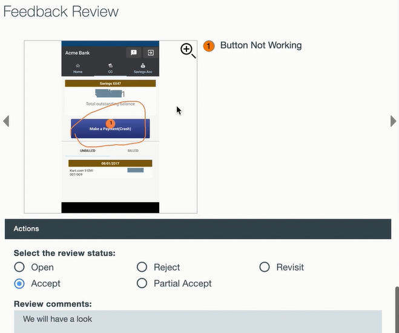

---

copyright:
  years: 2015, 2017
lastupdated: "2017-08-06"

---
{:new_window: target="_blank"}
{:shortdesc: .shortdesc}
{:screen:.screen}
{:codeblock:.codeblock}

# Dentro da Análise de Feedback do Aplicativo
{: #In-App}

## No app-Feedback Análise com Mobile Analytics

Com esse recurso do {{site.data.keyword.mobileanalytics_short}} -

- **Usuários e testadores** podem registrar e enviar feedback e relatórios de erro 'In-app' à medida que executarem e usarem o aplicativo
- **Proprietários de aplicativos** têm uma noção mais profunda da experiência do usuário do aplicativo com esse feedback de usuário de contexto rico
- **Desenvolvedores**, por outro lado, recebem contextos de aplicativos precisos para diagnosticar e corrigir erros/deficiências de recursos

## Ativando o feedback In-app

Conclua as etapas a seguir para permitir que seu aplicativo móvel capture o feedback do usuário In-App

**Intrumente seu aplicativo:**

 - Instrumente seu aplicativo móvel para entrar no modo de feedback. Chame a API `Analytics.triggerFeedbackMode();` para chamar o modo de feedback. Para obter mais informações [consulte a documentação](/docs/services/mobileanalytics/sdk.html)
 - A API pode ser chamada em qualquer evento de aplicativo, como botões, ações de menu ou gestos 
 
**Receber feedback In-app**

 - Usuários finais e testadores de seu aplicativo podem alternar para o modo de feedback acionando a ação do aplicativo que instrumentou para isso na etapa anterior
 - De dentro do feedback contextual rico do modo de feedback juntamente com uma captura de tela pode ser reunido e enviado ao serviço {{site.data.keyword.mobileanalytics_short}}

**Analisar o feedback In-App e agir sobre ele**

 - O serviço {{site.data.keyword.mobileanalytics_short}} recebe e consolida o feedback contextual rico enviado de aplicativos móveis
 - Efetue logon no Console de Serviço do Mobile Analytics e selecione a opção **Feedback do usuário** no painel de navegação à esquerda do console de serviço do {{site.data.keyword.mobileanalytics_short}} para visualizar os feedbacks

 
 - Um proprietário do aplicativo pode revisar o feedback, incluir comentários e identificar o feedback com um **status de revisão**.  Os comentários podem, normalmente, ser ações planejadas, como links para problemas Git criados para funcionar no feedback ou comentários podem ser a declaração das razões pelas quais nenhuma ação é necessária no feedback.   
 - O Status de Revisão pode ser usado para gerenciar de modo eficiente o feedback categorizando-o em um dos status diferentes

 

**Nota:**

 - O recurso está ativado somente para usuários que optaram pelo `Plano Avançado`. Selecione **Plano** no console de serviço do {{site.data.keyword.mobileanalytics_short}} para [upgrade](https://console-tok02-red.cdn.s-bluemix.net/docs/account/change-plan.html#changing).

 - Atualmente, esse recurso é suportado apenas no Android.

