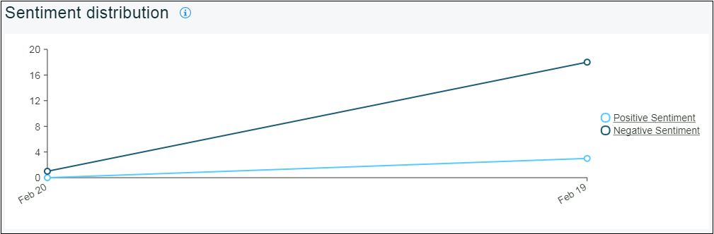

---

copyright:
  years: 2015, 2017
lastupdated: "2017-08-06"

---
{:new_window: target="_blank"}
{:shortdesc: .shortdesc}
{:screen:.screen}
{:codeblock:.codeblock}

# Análise de Sentimento
{: #sentimentanalysis}

## Sentiment Analysis com o Mobile Analytics

Com o {{site.data.keyword.mobileanalytics_short}}, é possível reunir e analisar as classificações que os usuários dão ao seu aplicativo.

O recurso Análise de Sentimentos

 - Reúne todos os dados de revisão extraindo-os dos feeds de revisão pública
 - Consolida as classificações da App Store e, após análise adicional, fornece uma pontuação de impressão ao seu aplicativo
 - Padrões/variações de pontuação de impressão podem ser visualizados usando gráficos
 - Seleciona palavras-chave dos feedbacks do usuário, as palavras-chave dão uma sugestão sobre para o que as classificações estão inclinadas
 
## Configurando Análise de Sentimentos

Para ativar a análise de sentimentos em seu aplicativo, conclua as etapas abaixo:

1. No console do {{site.data.keyword.mobileanalytics_short}}, selecione a guia **Configurar**.

2. Selecione a guia **Análise de Sentimentos**.

3. Clique no botão **Incluir**.  Selecione o **Nome do aplicativo** no menu suspenso.

4. Selecione o **Período de Análise**. 

5. Clique em **Origem** e mova-a para **Selecionado**.

6. Clique em **Salvar**.

Agora, você configurou seu aplicativo para a Análise de Sentimentos.

## Analisando os dados do aplicativo

A quantidade de dados disponíveis que é possível visualizar depende dos feedbacks do usuário fornecidos ao seu aplicativo. Dados estatísticos podem ser visualizados apenas quando os usuários forneceram um feedback com comentários.

 - No console do {{site.data.keyword.mobileanalytics_short}}, selecione a guia **Análise de Sentimentos** em **APP DATA**.

 - Selecione o intervalo de data, o aplicativo e a plataforma. Abaixo estão os gráficos que você encontrará para seu aplicativo

**Pontuação de impressão** para seu aplicativo com base nos comentários de revisão fornecidos pelos usuários 

**Classificação** do comentário de revisão com base na impressão

As **palavras-chave** que aparecem mais nos comentários de revisão do seu aplicativo

Seria preciso um mínimo de 6 horas para os dados de feedback refletirem no console do {{site.data.keyword.mobileanalytics_short}} depois de ter sido enviado pelo usuário.

**Nota:**
 - O recurso está ativado somente para usuários que optaram pelo `Plano Avançado`. Selecione **Plano** no console de serviço do {{site.data.keyword.mobileanalytics_short}} para [upgrade](https://console-tok02-red.cdn.s-bluemix.net/docs/account/change-plan.html#changing).
 - Atualmente, o recurso de análise de sentimentos está disponível no `IBM Cloud - Região Sul dos EUA` e é aplicável na `plataforma iOS`.

