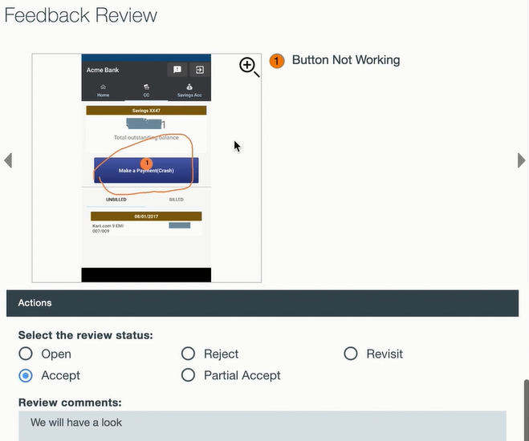

---

copyright:
  years: 2015, 2017
lastupdated: "2017-08-06"

---
{:new_window: target="_blank"}
{:shortdesc: .shortdesc}
{:screen:.screen}
{:codeblock:.codeblock}

# 应用程序内反馈分析
{: #In-App}

## Mobile Analytics 的应用程序内反馈分析

使用 {{site.data.keyword.mobileanalytics_short}} 的以下功能 -

- **用户和测试者**可以在运行和使用应用程序时，记录和发送应用程序内反馈及错误报告
- **应用程序所有者**可利用此丰富的上下文用户反馈，更深入地了解应用程序的用户体验
- 另一方面，**开发者**可接收准确的应用程序上下文，以诊断和更正错误/功能缺陷

## 启用应用程序内反馈

完成以下步骤以支持移动应用程序捕获应用程序内用户反馈

**检测应用程序：**

 - 检测移动应用程序，以进入反馈方式。调用 API `Analytics.triggerFeedbackMode();` 以调用反馈方式。有关更多信息，请参阅[文档](/docs/services/mobileanalytics/sdk.html)
 - 可以在任何应用程序事件（如按钮、菜单操作或手势）上调用 API 
 
**接收应用程序内反馈**

 - 通过触发先前步骤中为此检测到的应用程序操作，可以将应用程序的最终用户和测试者切换到反馈方式
 - 在反馈方式中，可以收集丰富的上下文反馈以及屏幕快照，并将其发送到 {{site.data.keyword.mobileanalytics_short}} 服务

**分析应用程序内反馈并对其执行操作**

 - {{site.data.keyword.mobileanalytics_short}} 服务接收并合并移动应用程序发送的丰富上下文反馈
 - 登录到 Mobile Analytics 服务控制台，然后选择 {{site.data.keyword.mobileanalytics_short}} 服务控制台左侧导航窗格中的**用户反馈**选项以查看反馈

 
 - 应用程序所有者可以复查反馈，添加注释以及使用**评论状态**来标记反馈。注释通常可能是计划的操作（例如，指向创建用于处理反馈的 Git 问题的链接），或者注释可能是原因陈述，说明反馈为什么不需要执行任何操作。   
 - “复查状态”可以用于将反馈分类到多个不同状态中的一个状态下，从而有效地管理反馈。

 

**注：**

 - 仅对已选择`高级套餐`的用户启用此功能。在 {{site.data.keyword.mobileanalytics_short}} 服务控制台中选择**套餐**以[升级](https://console-tok02-red.cdn.s-bluemix.net/docs/account/change-plan.html#changing)。

 - 目前，仅 Android 上支持此功能。

