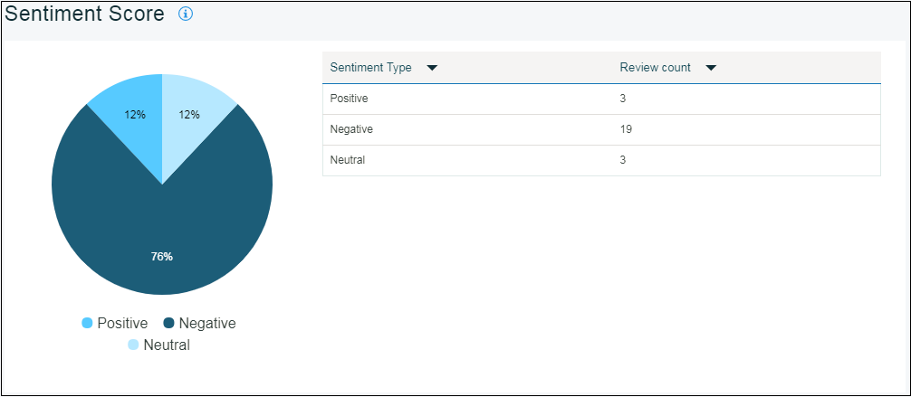
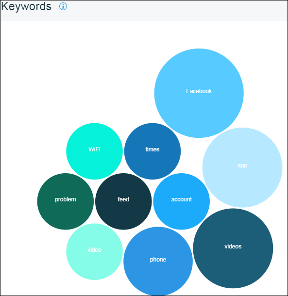

---

copyright:
  years: 2015, 2017
lastupdated: "2017-08-06"

---
{:new_window: target="_blank"}
{:shortdesc: .shortdesc}
{:screen:.screen}
{:codeblock:.codeblock}

# 观点分析
{: #sentimentanalysis}

## Mobile Analytics 的观点分析

通过 {{site.data.keyword.mobileanalytics_short}}，可以收集和分析用户对应用程序提供的评级。

“观点分析”功能 -

 - 通过从公共评论订阅源中抽取所有评论数据，将其集合在一起
 - 合并应用程序商店评级，在进一步分析后，为应用程序提供观点评分
 - 观点评分模式/变化可以使用图表进行可视化
 - 从用户反馈中选取关键字，关键字提供了有关评级倾向的线索
 
## 配置观点分析

要对应用程序启用观点分析，请完成以下步骤：

1. 在 {{site.data.keyword.mobileanalytics_short}} 控制台上，选择**配置**选项卡。

2. 选择**观点分析**选项卡。

3. 单击**添加**按钮。从下拉菜单中选择**应用程序名称**。

4. 选择**分析周期**。 

5. 单击**源**，然后将其移动到**所选项**。

6. 单击**保存**。

现在，您已将应用程序配置用于观点分析。

## 分析应用程序数据

可以查看的可用数据量取决于用户对应用程序提供的反馈。仅当用户提供包含注释的反馈时，才能查看统计数据。

 - 在 {{site.data.keyword.mobileanalytics_short}} 控制台上，选择**应用程序数据**下的**观点分析**选项卡。

 - 选择日期范围、应用程序和平台。下面是将为应用程序找到的图表 -

**观点评分**：应用程序的观点评分基于用户提供的评论注释 

**分类**：评论注释的分类基于观点

**关键字**：在应用程序的评论注释中出现的关键字

用户提交反馈数据后，反馈数据至少需要 6 小时才会反映在 {{site.data.keyword.mobileanalytics_short}} 控制台中。

**注：**
 - 仅对已选择`高级套餐`的用户启用此功能。在 {{site.data.keyword.mobileanalytics_short}} 服务控制台中选择**套餐**以[升级](https://console-tok02-red.cdn.s-bluemix.net/docs/account/change-plan.html#changing)。
 - 目前，观点分析功能在 `IBM Cloud - 美国南部区域`中可用，并且适用于 `iOS 平台`。

