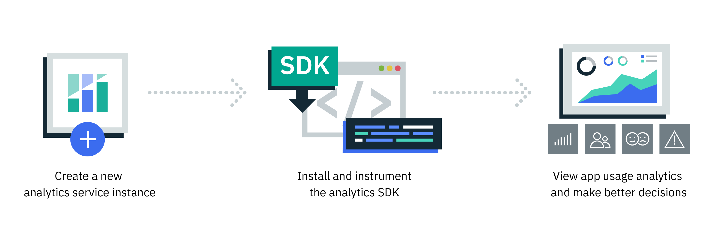

---

copyright:
  years: 2016, 2017
lastupdated: "2017-07-14"

---
{:new_window: target="_blank"}
{:shortdesc: .shortdesc}
{:screen:.screen}
{:codeblock:.codeblock}

# 入门教程

{: #gettingstartedtemplate}

{{site.data.keyword.mobileanalytics_full}} 帮助开发者、IT 管理员和业务利益相关方深入了解移动应用程序的执行方式和使用方式。 

利用 {{site.data.keyword.mobileanalytics_short}}，您可以 - 

* 从台式机或图形输入板监视所有应用程序的性能和使用情况。 
* 快速识别趋势和异常，向下钻取以解决问题，并在关键度量值超过严重阈值时触发警报。
{: shortdesc}

入门基本步骤包括：

1. [完成先决条件](/docs/services/mobileanalytics/app-prerequisites.html)
2. [检测应用程序](/docs/services/mobileanalytics/app-instrument.html)
3. 在移动仿真器或设备上编译并运行应用程序。
4. [获取应用程序数据](/docs/services/mobileanalytics/app-monitoring-metrics.html)

下面是 {{site.data.keyword.mobileanalytics_short}} 服务生命周期的概览图。

##演示模式

{{site.data.keyword.mobileanalytics_short}} 控制台中提供了**演示模式**选项，其中视图和图表显示**演示数据**。实例化服务之后，初始启动控制台时，缺省模式为演示模式。将您自己的应用程序和分析数据填充到服务中后，您可以*关闭*演示模式，从而以其他图表形式查看应用程序的数据。当处于演示模式时，{{site.data.keyword.mobileanalytics_short}} 控制台是只读的，因此您无法创建新警报定义。

