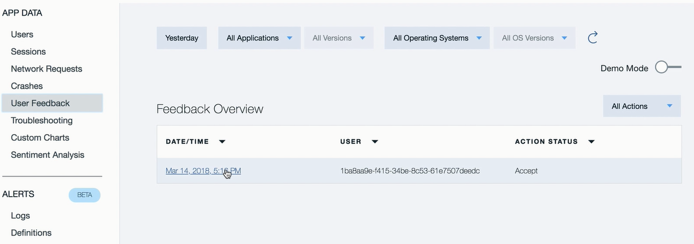

---

copyright:
  years: 2015, 2017
lastupdated: "2017-08-06"

---
{:new_window: target="_blank"}
{:shortdesc: .shortdesc}
{:screen:.screen}
{:codeblock:.codeblock}

# 應用程式內意見分析
{: #In-App}

## 使用 Mobile Analytics 進行應用程式內意見分析

使用 {{site.data.keyword.mobileanalytics_short}} 的這項特性：

- **使用者及測試者**可以在執行及使用應用程式時，「在應用程式內」記錄及傳送意見和錯誤報告
- **應用程式擁有者**利用此環境定義豐富的使用者意見，更深入瞭解應用程式的使用者體驗
- 另一方面，**開發人員**可以接收精確的應用程式環境定義，以診斷並修正錯誤/特性缺陷

## 啟用應用程式內意見

完成下列步驟，讓行動應用程式能擷取應用程式內使用者意見

**檢測應用程式：**

 - 檢測行動應用程式，以進入意見模式。呼叫 API `Analytics.triggerFeedbackMode();`，以呼叫意見模式。如需相關資訊，[請參閱文件](/docs/services/mobileanalytics/sdk.html)
 - 可以在任何應用程式事件（例如按鈕、功能表動作或手勢）上呼叫 API 
 
**接收應用程式內意見**

 - 應用程式的一般使用者及測試人員可以切換至意見模式，方法是觸發在前一個步驟中為此進行檢測的應用程式動作
 - 從意見模式豐富環境定義意見與擷取畫面，可以收集及傳送 {{site.data.keyword.mobileanalytics_short}} 服務

**分析「應用程式內意見」並進行處理**

 - {{site.data.keyword.mobileanalytics_short}} 服務可以接收及合併從行動應用程式傳送的豐富環境定義意見
 - 登入「Mobile Analytics 服務主控台」，然後選取 {{site.data.keyword.mobileanalytics_short}} 服務主控台左導覽窗格中的**使用者意見**選項來檢視意見

 
 - 應用程式擁有者可以檢閱意見、新增註解，並使用**檢閱狀態**來標記意見。註解通常是規劃的動作（例如處理意見所建立之 Git 問題的鏈結），或註解可以是有關為何不需要對意見採取動作之原因的陳述。   
 - 「檢閱狀態」可以用來有效率地管理意見，方法是將它們分類在其中一個不同的狀態下

 

**附註：**

 - 只有已選擇`進階方案`的使用者才能啟用此特性。將 {{site.data.keyword.mobileanalytics_short}} 服務主控台中的**方案**選取為[升級](https://console-tok02-red.cdn.s-bluemix.net/docs/account/change-plan.html#changing)。

 - 目前，只有 Android 才支援此特性。

