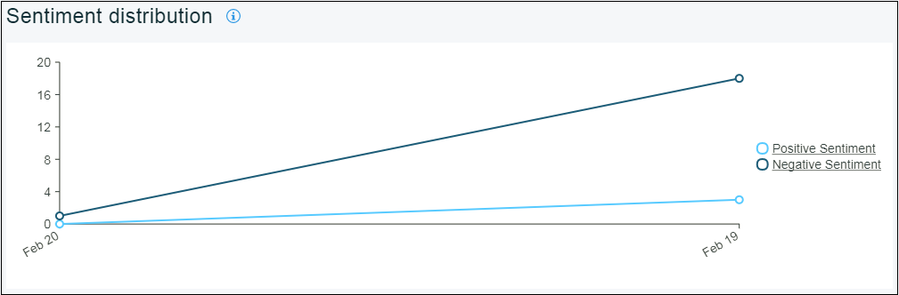

---

copyright:
  years: 2015, 2017
lastupdated: "2017-08-06"

---
{:new_window: target="_blank"}
{:shortdesc: .shortdesc}
{:screen:.screen}
{:codeblock:.codeblock}

# 觀感分析
{: #sentimentanalysis}

## 使用 Mobile Analytics 進行觀感分析

透過 {{site.data.keyword.mobileanalytics_short}}，您可以收集並分析使用者對應用程式的評分。

「觀感分析」功能：

 - 將所有檢閱資料合併在一起，方法是從公用檢閱資訊來源中進行擷取
 - 合併「應用程式市集」評分，並在進一步分析之後，提供應用程式的觀感評分
 - 可以使用圖表將觀感評分模式/變異視覺化
 - 從使用者意見中挑選關鍵字，關鍵字提供評分趨勢的提示
 
## 配置觀感分析

若要在應用程式上啟用觀感分析，請完成下列步驟：

1. 在 {{site.data.keyword.mobileanalytics_short}} 主控台上，選取**配置**標籤。

2. 選取**觀感分析**標籤。

3. 按一下**新增**按鈕。從下拉功能表中，選取**應用程式名稱**。

4. 選取**分析期間**。 

5. 按一下**來源**，並將它移至**已選取**。

6. 按一下**儲存**。

您現在已配置應用程式來進行「觀感分析」。

## 分析應用程式資料

您可以檢視的可用資料量，取決於使用者針對應用程式所提供的意見。只有在使用者已提供含註解的意見時，才能檢視統計資料。

 - 在 {{site.data.keyword.mobileanalytics_short}} 主控台上，選取**應用程式資料**下的**觀感分析**標籤。

 - 選取日期範圍、應用程式及平台。下面是您將針對應用程式找到的圖表：

根據使用者所提供檢閱評論的應用程式**觀感評分** 

根據觀感之檢閱評論的**分類**

應用程式檢閱評論中最常出現的**關鍵字**

意見資料在使用者提交之後，最少需要 6 小時的時間才會反映在 {{site.data.keyword.mobileanalytics_short}} 主控台中。

**附註：**
 - 只有已選擇`進階方案`的使用者才能啟用此特性。將 {{site.data.keyword.mobileanalytics_short}} 服務主控台中的**方案**選取為[升級](https://console-tok02-red.cdn.s-bluemix.net/docs/account/change-plan.html#changing)。
 - 觀感分析特性目前在 `IBM Cloud - 美國南部地區`提供，並且適用於 `iOS 平台`。

